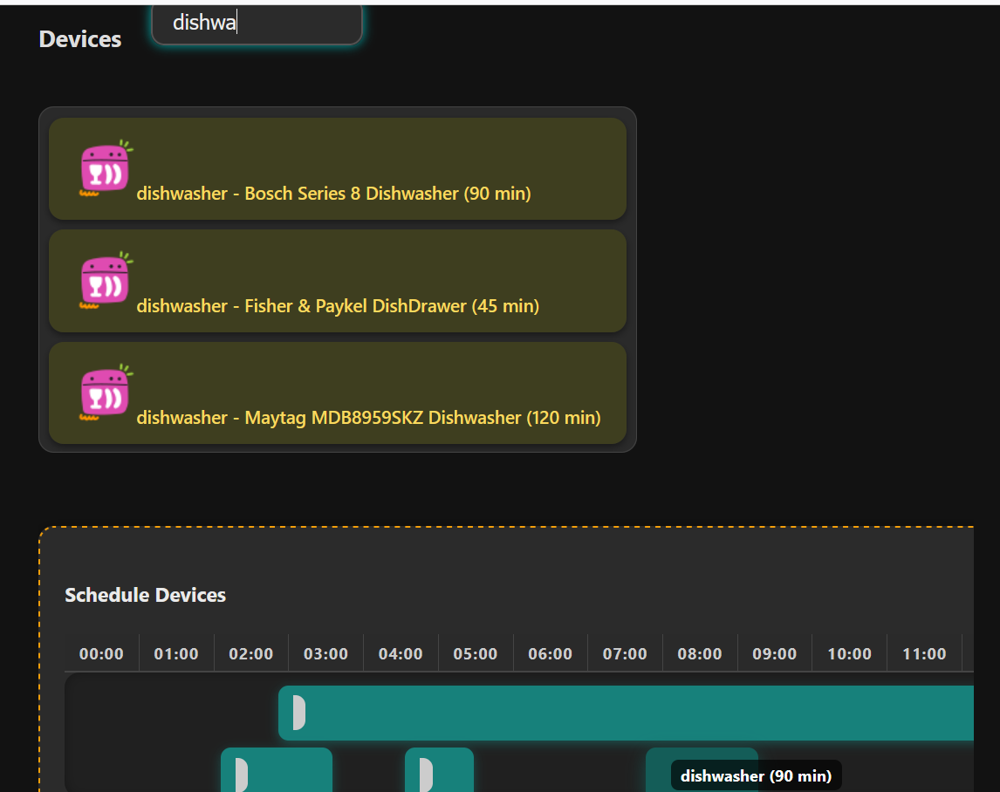

# ⚡ Energy Planner

A modern web app to help users plan and optimize their home energy usage by scheduling devices efficiently. Built with accessibility, responsiveness, and dark mode in mind.

## 🚀 Features

- 🔐 **Login & Registration** popups for user session simulation
- 🌙 **Dark Mode** toggle with preference saved in `localStorage`
- 🧑‍💻 **Accessible Font Size Controls** (A+ / A-)
- 🔌 **Device Scheduling** via drag-and-drop interface
- 🧭 **Searchable Device List**
- 💡 **Dynamic UI Changes** based on login state
- 🎨 Polished, responsive layout with dark mode styling
- 📸 Unlogged users are shown a **Call to Action** with illustration and button

## 📷 Preview

## 🛠️ Tech Stack

- HTML5 / CSS3
- JavaScript (Modules)
- LocalStorage (for session and theme persistence)

## 🙌 Author

Kacper Książek IO3
